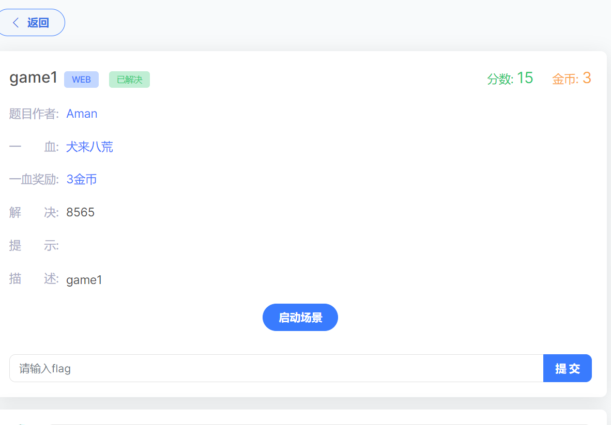

一开始真不知道这种东西试什么玩意，本来看到url有个参数传递，我以为是sql注入，试了半天用sqlmap扫不出来，然后看wp 看到这种题目是需要突破分数数值上限的，

​	还学到一个东西名为 sign  似乎是某种签名

​	我们在网络中查看到一个数据包 为 score 看到请求头上有一个sign，判断为加密

​	这个加密说实话不看提示真不没能才出来，他结构为zM + base64(分数) + = 三部分组成，然后我们解密得到中间部分是一个分数加密值，所以我们重发数据包，查看返回得到flag

sign 签名

zMOTk5OTk5OTk5OTk5OTk5OTk5OTk5OTk5OTk5OTk5OQ===
