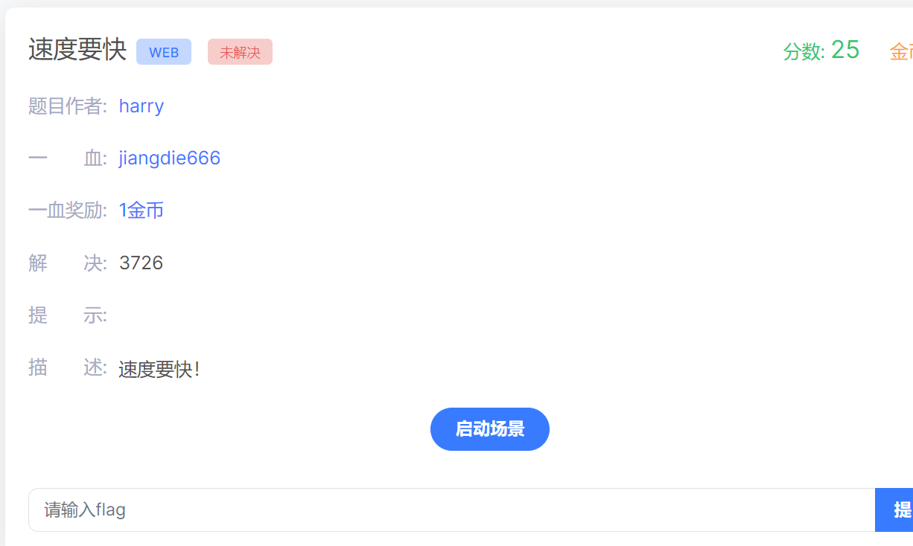
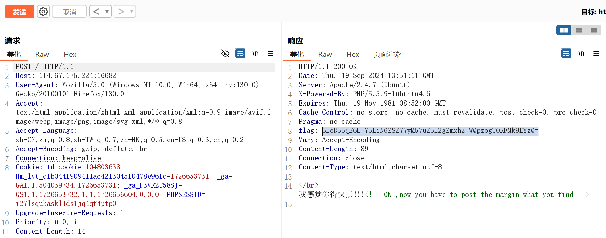
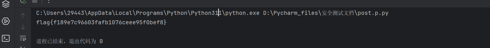

`repr(x)` 则保持了字符串的原始形式，包括转义字符。

抓包得到一个flag base64加密值 两次解密之后获得一个margin值（这个margin参数是题目中提示的）



根据响应头中的flag内容结构，我们进行写脚本代码

```python
import requests
import base64

s = requests.Session()
head_1 = s.get("http://114.67.175.224:16682").headers  # 结果作为数组返回

base_1 = base64.b64decode(head_1['flag']) # 这里flag作为字符串需要加引号，这里header
base_2 = base64.b64decode(repr(base_1).split(":")[1]) # 截取后面的然后再解码

data = {'margin': base_2}   # 为什么要使用键值对作为data进行post呢？？
flag = s.post("http://114.67.175.224:16682",data = data) # 这里使用s.post是为了获得一个长久维持的session值
print (flag.text)  #  需要使用text显示文字
```



得到这样一个flag，完成任务
