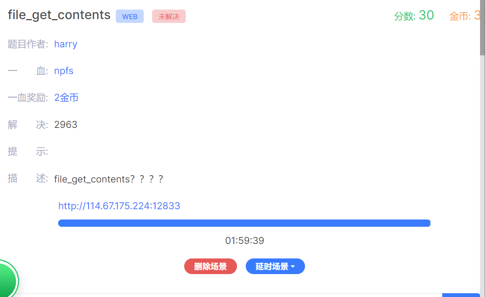
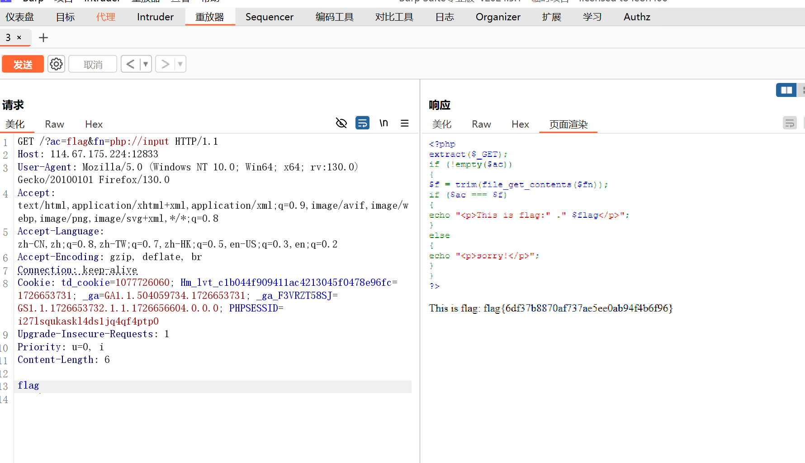

题目显示可能需要使用这一个函数file_get_contents


·`<?php`
`extract($_GET);`  //  键值对转换为变量
`if (!empty($ac))` 如果ac不为空 则为真， 为空则为假
`{`
`$f = trim(file_get_contents($fn));`
`if ($ac === $f)`
`{`
`echo "<p>This is flag:" ." $flag</p>";`
`}`
`else`
`{`
`echo "<p>sorry!</p>";`
`}`
`}`
`?>`

这是题目的php内容


我们使用php协议流进行读取文件

使用bp请求 + 传上一个文件flag




这是原理：

你所描述的利用 PHP 伪协议攻击的原理涉及到 PHP 的流封装器（stream wrappers），尤其是 `php://input`。这种攻击利用了 PHP 的特性，允许攻击者通过伪协议来获取或注入数据。这种技术通常被用于绕过文件读取限制和读取从 HTTP 请求主体传递的数据。

### **详细解释：**

#### **1. PHP 伪协议**

PHP 支持多种流封装器（stream wrappers），其中包括 `php://input`、`php://output`、`php://memory` 等。这些伪协议允许你访问特殊的流或数据源：

- **`php://input`**：用于访问请求主体的原始数据。这是只读的流，通常用于获取 `POST` 请求的数据，而不会经过 PHP 的自动处理（例如表单数据）。

- **`php://output`**：用于访问 PHP 输出缓冲区，通常用于流式输出数据。

#### **2. 代码分析**

你的代码示例是：
```php
<?php
extract($_GET);
if (!empty($ac))
{
    $f = trim(file_get_contents($fn));
    if ($ac === $f)
    {
        echo "<p>This is flag:" ." $flag</p>";
    }
    else
    {
        echo "<p>sorry!</p>";
    }
}
?>
```

- **`extract($_GET);`**：将 `$_GET` 数组中的参数提取为变量，例如 `ac`、`fn` 和 `flag`。
- **`file_get_contents($fn)`**：根据 `fn` 参数的值读取文件内容。
- **`trim()`**：去除读取内容的前后空白字符。
- **`$ac === $f`**：比较 `ac` 参数的值与读取文件的内容是否相等。如果相等，则输出 `flag` 的值，否则输出 `"sorry!"`。

#### **3. 攻击步骤**

**a. 使用 Burp Suite**：

1. **拦截请求**：
   - 使用 Burp Suite 拦截你与服务器的请求。

2. **发送到 Repeater**：
   - 将拦截的请求发送到 Burp Suite 的 Repeater 工具进行修改。

**b. 构造攻击请求**：

- **`?ac=flag&fn=php://input`**：
  - 通过将 `fn` 参数设置为 `php://input`，你指示 PHP 从请求主体中读取数据。

- **在请求主体中添加 `flag`**：
  - 在请求的主体部分添加 `flag` 数据，使得当 `file_get_contents('php://input')` 被调用时，它会读取这个主体数据。你可以通过 `POST` 请求将数据传递到 `php://input` 流中。

**c. 发送请求并获取响应**：

- 发送修改后的请求，服务器会将 `php://input` 流的内容（即 `flag`）作为文件内容读取，并与 `ac` 参数进行比较。如果匹配，将输出 `flag`。

### **攻击原理总结**

- **利用伪协议**：通过使用 `php://input` 伪协议，你绕过了文件路径限制，直接从请求主体读取数据。
- **数据注入**：在 `POST` 请求的主体中注入数据，使得 `file_get_contents('php://input')` 返回你注入的数据。
- **绕过验证**：通过这种方式，你可以控制 `$ac` 和 `$f` 的内容，使得两者匹配，从而泄露 `flag`。

### **安全建议**

- **验证和消毒输入**：不要直接使用用户输入的路径，尤其是在涉及到文件操作时。
- **限制访问**：限制可以读取的文件路径，避免任意文件读取。
- **使用白名单**：对文件路径进行严格的验证和白名单检查，确保只有允许的文件能够被读取。

通过理解这些原理和步骤，你可以更好地防范类似的攻击，确保你的应用程序不会受到这些安全漏洞的威胁。
